<p align="center"><a href="https://laravel.com" target="_blank"></a></p>

# Laravel Library Management System

## Quick Start 
clone the repo
```
    git clone https://github.com/tauseedzaman/Laravel-libraray-management-system
```

change current directory

```
cd Laravel-libraray-management-system
```
install dependencies
```
composer install
````
create .env file
```
cp (unix) or copy (Windows) .env.example .env
```
generate env key
```
php artisan key:generate
```
migrate the migration and seed the database
```
php artisan migrate:fresh --seed
```
start server
```
php artisan serve
```
credentails
```
username: hardik
password: password
```
# That's all 🎊🎉 

## ScreenShots
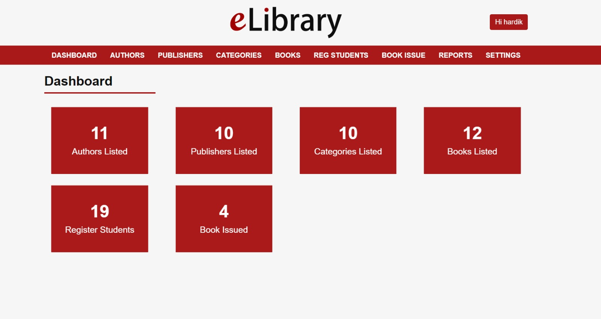<br /> <br />
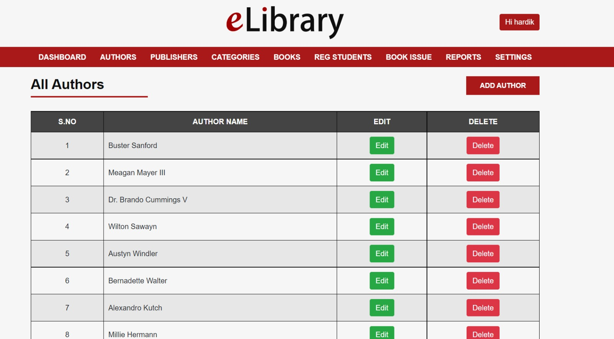<br /> <br />
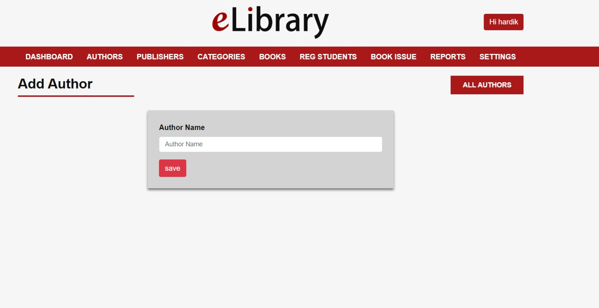<br /> <br />
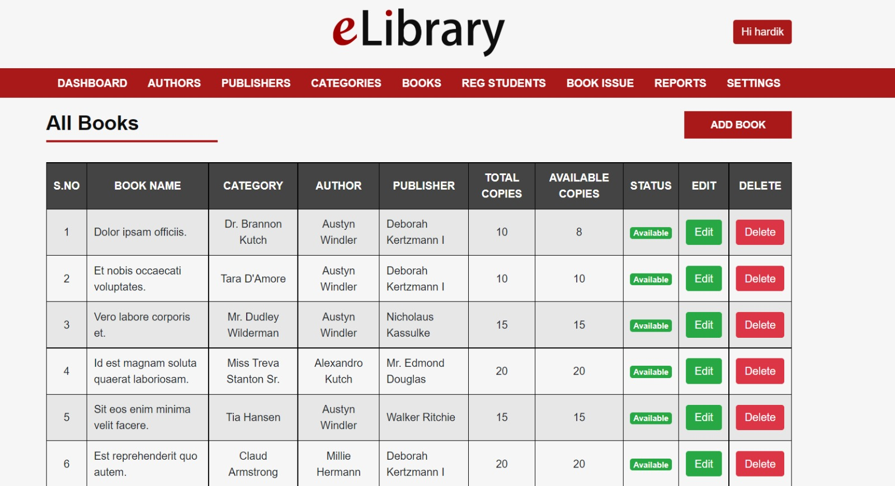<br /> <br />
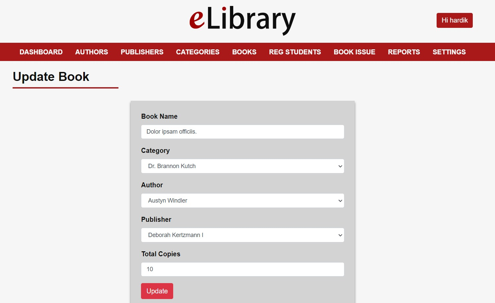<br /> <br />
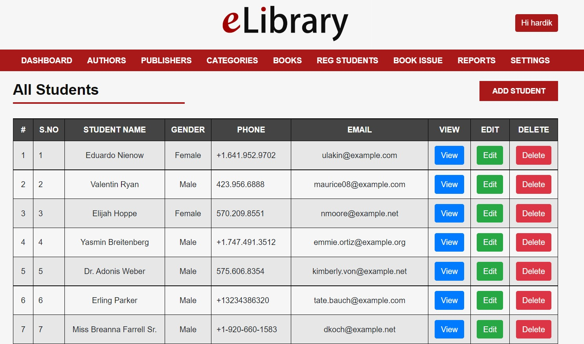<br /> <br />
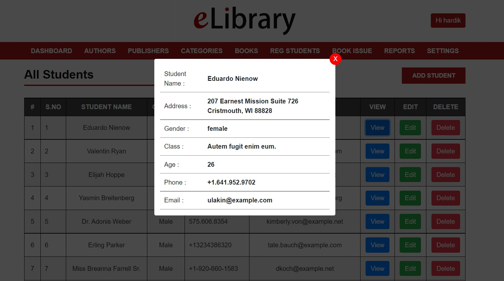<br /> <br />
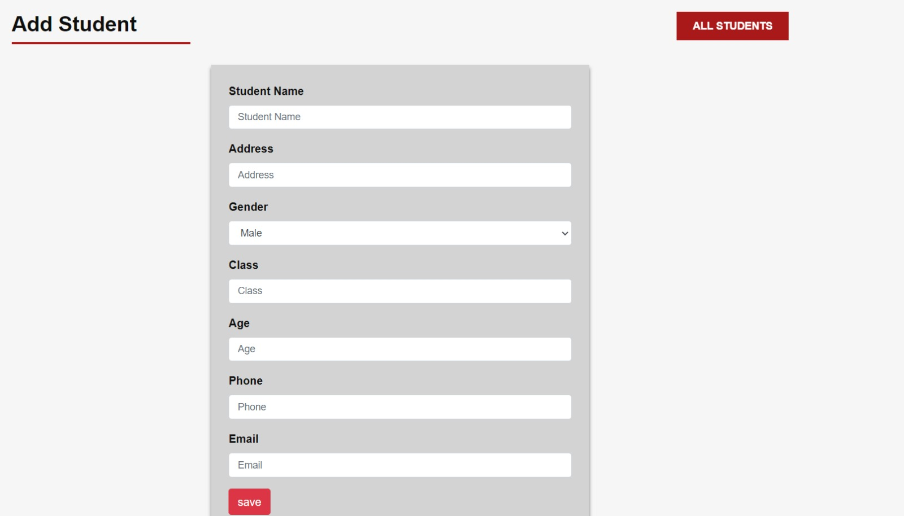<br /> <br />
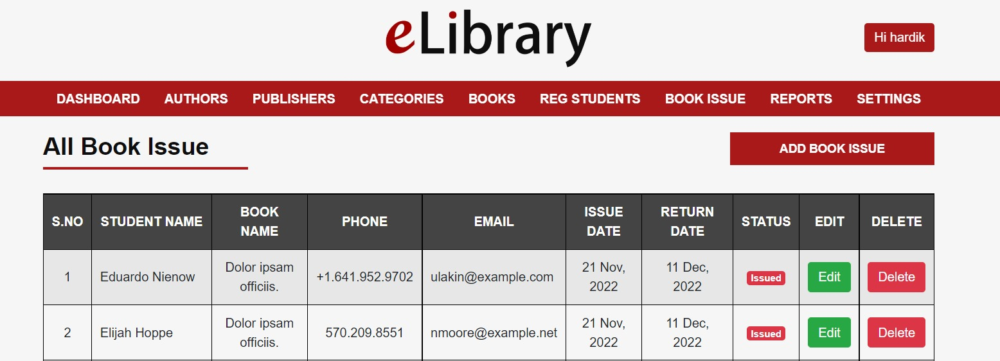<br /> <br />
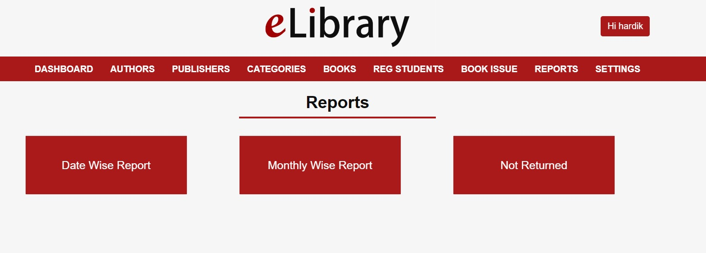<br /> <br />
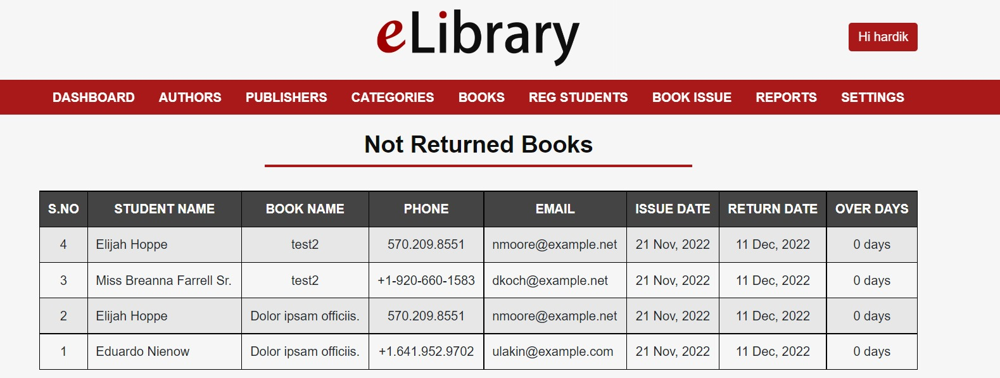<br /> <br />
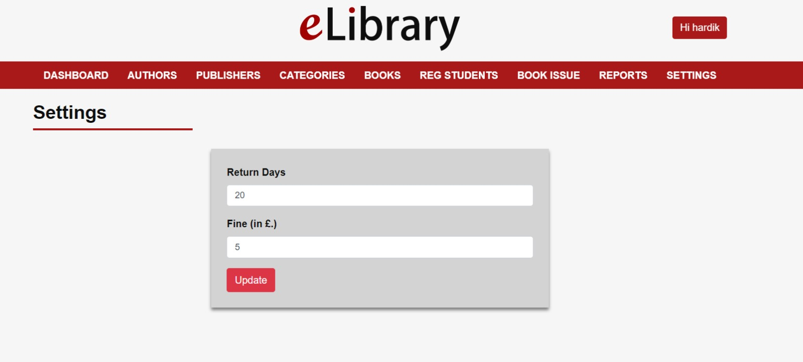<br /> <br />
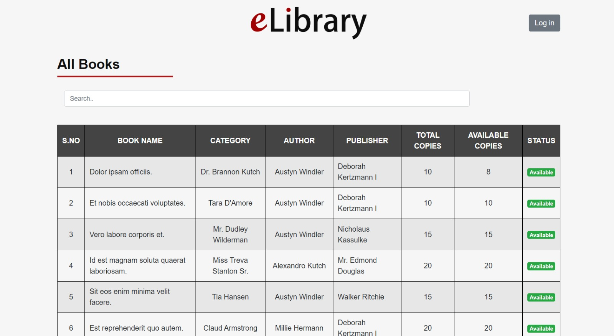<br /> <br />
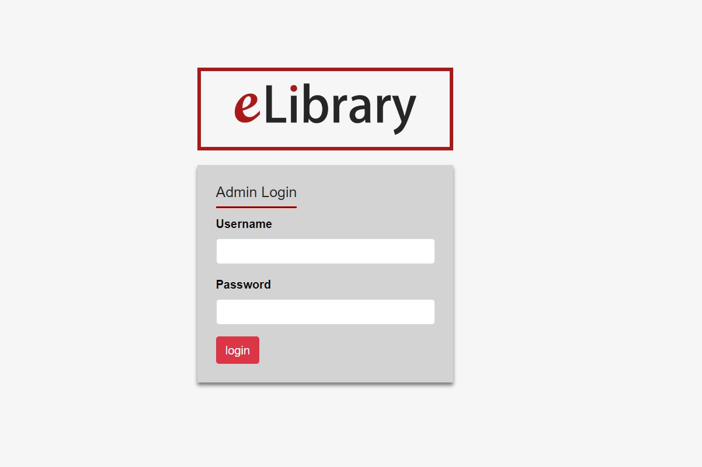<br /> <br />
